---
## Front matter
lang: ru-RU
title: Лабораторная работа №4
subtitle: Первоначальное конфигурирование сети

author:
  - Замбалова Дина Владимировна
institute:
  - Российский университет дружбы народов, Москва, Россия

## i18n babel
babel-lang: russian
babel-otherlangs: english

## Formatting pdf
toc: false
toc-title: Содержание
slide_level: 2
aspectratio: 169
section-titles: true
theme: metropolis
header-includes:
 - \metroset{progressbar=frametitle,sectionpage=progressbar,numbering=fraction}
 - '\makeatletter'
 - '\beamer@ignorenonframefalse'
 - '\makeatother'
---

# Информация

## Докладчик

:::::::::::::: {.columns align=center}
::: {.column width="70%"}

  * Замбалова Дина Владимировна
  * студентка
  * Российский университет дружбы народов
  * [1132226536@pfur.ru](mailto:1032216453@pfur.ru)
  * <https://github.com/dvzambalova>

:::
::: {.column width="25%"}

:::
::::::::::::::

## Цель работы

Получить основные навыки по настройке VLAN на коммутаторах сети.

## Задание

1. На коммутаторах сети настроить Trunk-порты на соответствующих интерфейсах, связывающих коммутаторы между собой.

2. Коммутатор msk-donskaya-sw-1 настроить как VTP-сервер и прописать на
нём номера и названия VLAN.

3. Коммутаторы msk-donskaya-sw-2 — msk-donskaya-sw-4, mskpavlovskaya-sw-1 настроить как VTP-клиенты, на интерфейсах указать
принадлежность к соответствующему VLAN.

4. На серверах прописать IP-адреса.

## Задание

5. На оконечных устройствах указать соответствующий адрес шлюза и прописать статические IP-адреса из диапазона соответствующей сети, следуя регламенту выделения ip-адресов.

6. Проверить доступность устройств, принадлежащих одному VLAN, и недоступность устройств, принадлежащих разным VLAN.

7. При выполнении работы необходимо учитывать соглашение об именовании.

## Выполнение лабораторной работы

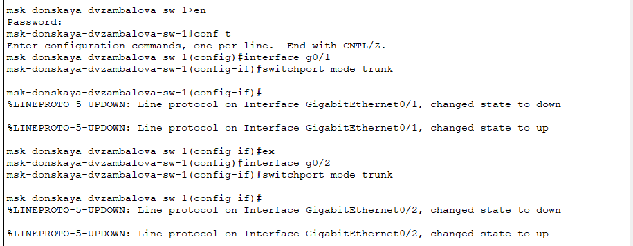{#fig:001 width=70%}

## Выполнение лабораторной работы

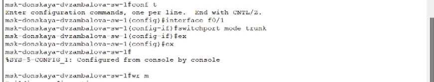{#fig:001 width=70%}

## Выполнение лабораторной работы

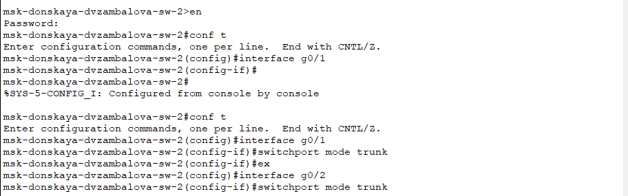{#fig:001 width=70%}

## Выполнение лабораторной работы

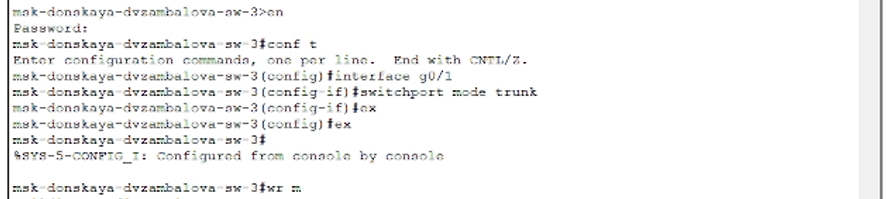{#fig:001 width=70%}

## Выполнение лабораторной работы

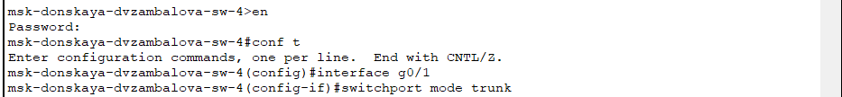{#fig:001 width=70%}

## Выполнение лабораторной работы

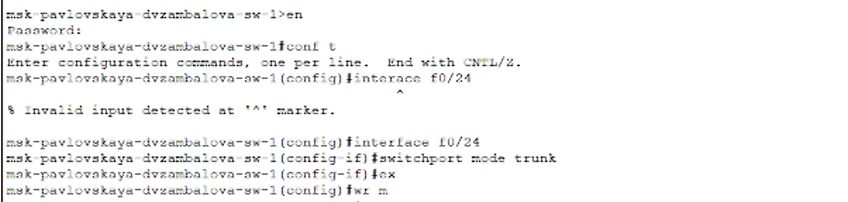{#fig:001 width=70%}

## Выполнение лабораторной работы

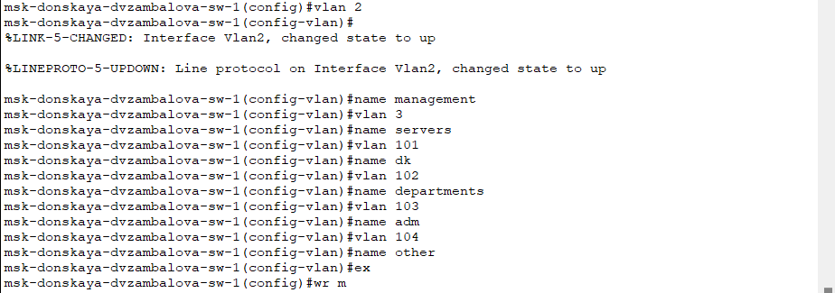{#fig:001 width=70%}

## Выполнение лабораторной работы

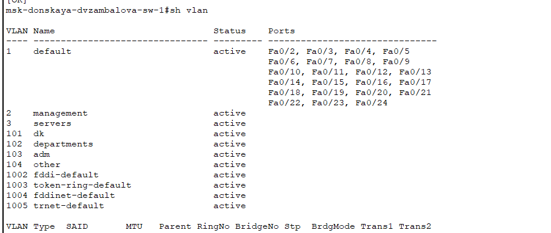{#fig:001 width=70%}

## Выполнение лабораторной работы

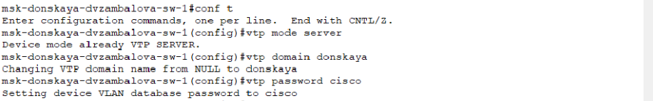{#fig:001 width=70%}

## Выполнение лабораторной работы

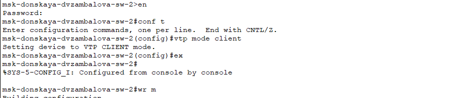{#fig:001 width=70%}

## Выполнение лабораторной работы

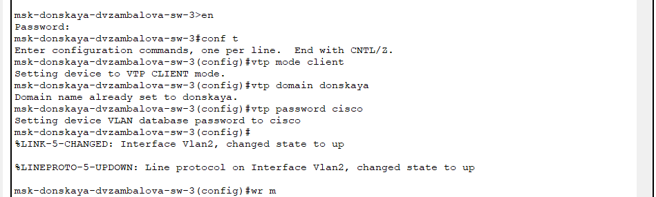{#fig:001 width=70%}

## Выполнение лабораторной работы

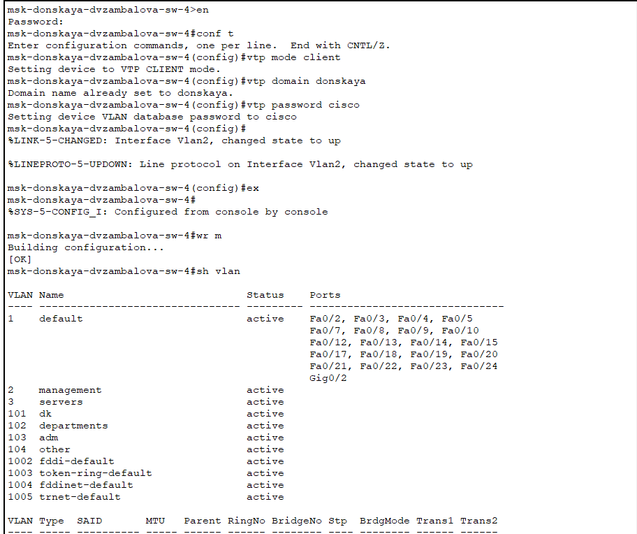{#fig:001 width=70%}

## Выполнение лабораторной работы

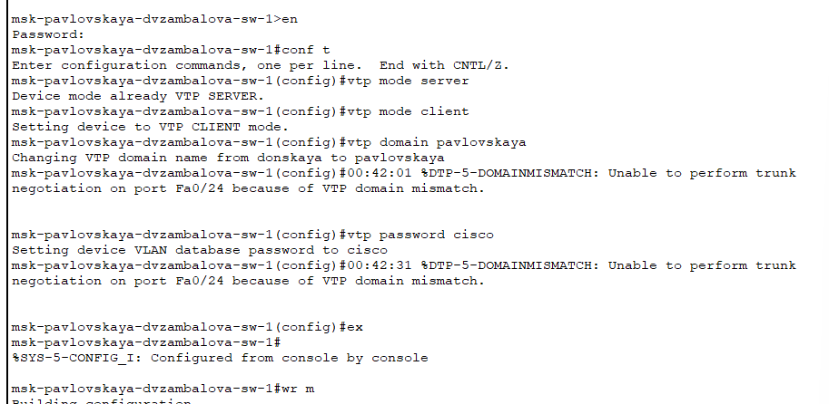{#fig:001 width=70%}

## Выполнение лабораторной работы

Выполним эту конфигурацию в соответствии с таблицей:

:Таблица портов

| Устройство                       | Порт        | Примечание           | Access VLAN | Trunk VLAN               |
|----------------------------------|-------------|----------------------|-------------|--------------------------|
| msk-donskaya-dmbelicheva-gw-1    | f0/1        | UpLink               |             |                          |
|                                  | f0/0        | msk-donskaya-sw-1    |             | 2, 3, 101, 102, 103, 104 |
| msk-donskaya-dmbelicheva-sw-1    | f0/24       | msk-donskaya-gw-1    |             | 2, 3, 101, 102, 103, 104 |
|                                  | g0/1        | msk-donskaya-sw-2    |             | 2, 3                     |
|                                  | g0/2        | msk-donskaya-sw-4    |             | 2, 101, 102, 103, 104    | 

## Выполнение лабораторной работы

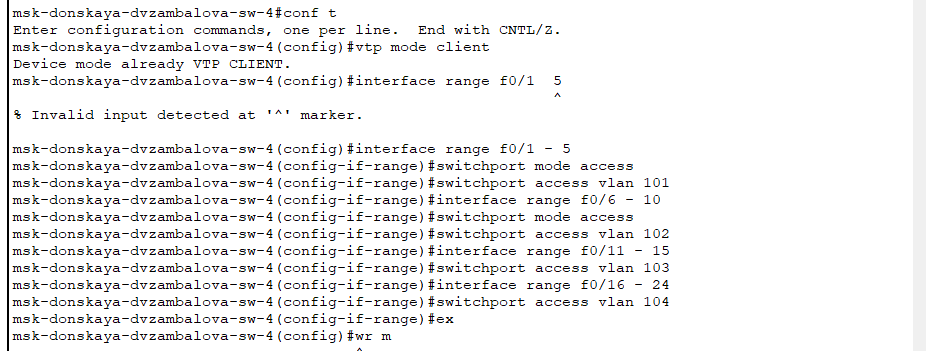{#fig:001 width=70%}

## Выполнение лабораторной работы

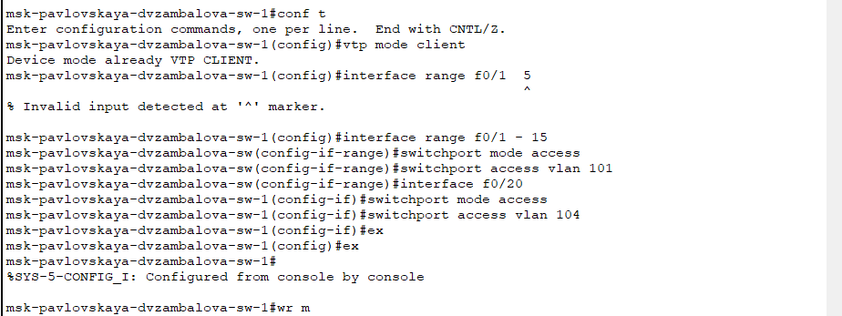{#fig:001 width=70%}

## Выполнение лабораторной работы

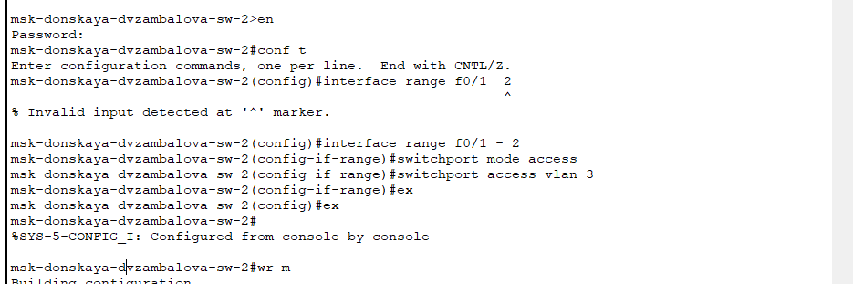{#fig:001 width=70%}

## Выполнение лабораторной работы

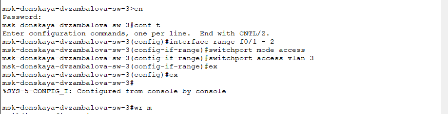{#fig:001 width=70%}

## Выполнение лабораторной работы

Задавать IP-адреса будем в соответствии с таблицей:

:Таблица IP. Сеть 10.128.0.0/16

| IP-адреса               | Примечание                 | VLAN |
|-------------------------|----------------------------|------|
| 10.128.0.0/16           | Вся сеть                   |      |
| 10.128.0.0/24           | Серверная ферма            | 3    |
| 10.128.0.1              | Шлюз                       |      |
| 10.128.0.2              | Web                        |      |
| 10.128.0.3              | File                       |      |

## Выполнение лабораторной работы

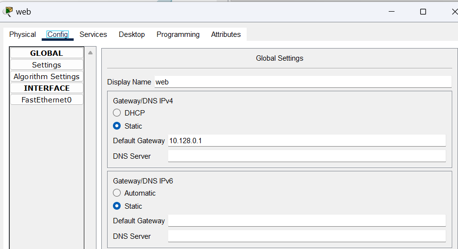{#fig:001 width=70%}

## Выполнение лабораторной работы

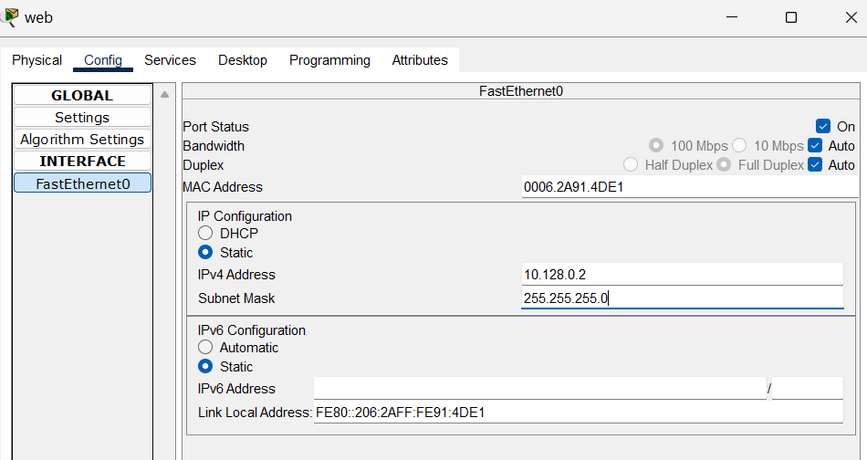{#fig:001 width=50%}

## Выполнение лабораторной работы

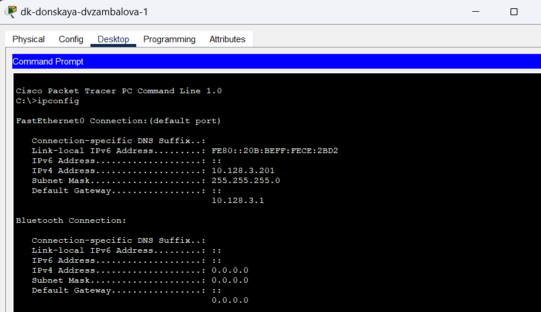{#fig:001 width=70%}

## Выполнение лабораторной работы

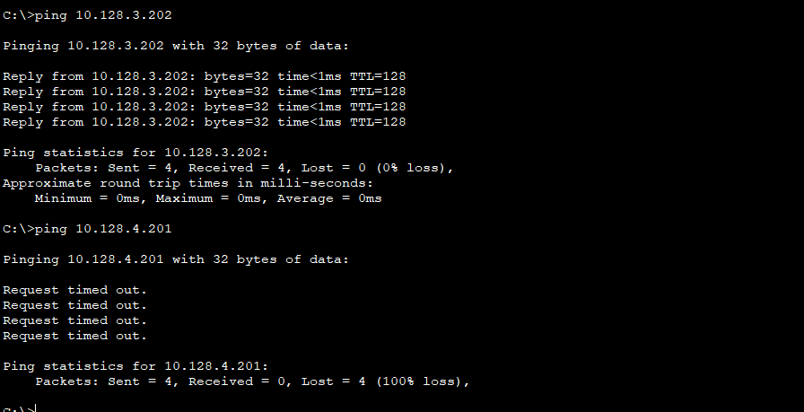{#fig:001 width=50%}

## Выполнение лабораторной работы

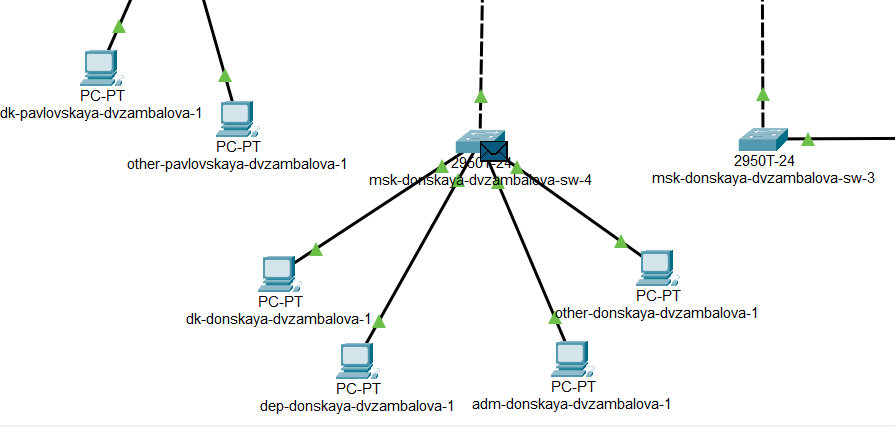{#fig:001 width=50%}

## Выполнение лабораторной работы

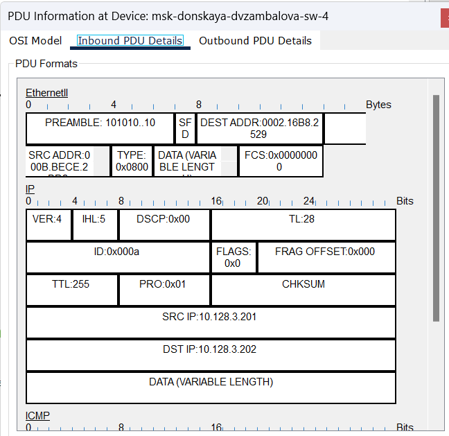{#fig:001 width=50%}

## Выполнение лабораторной работы

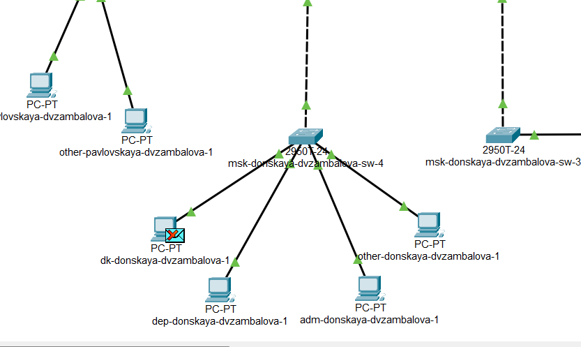{#fig:001 width=50%}

## Выводы

В процессе выполнения данной лабораторной работы я получила основные навыки по настройке VLAN на коммутаторах сети.