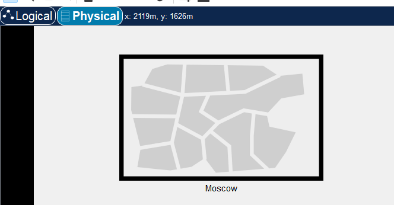
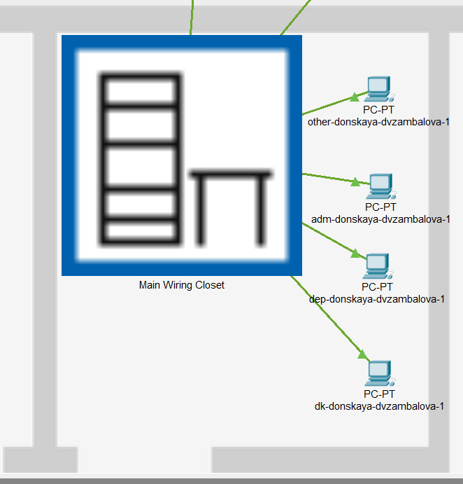
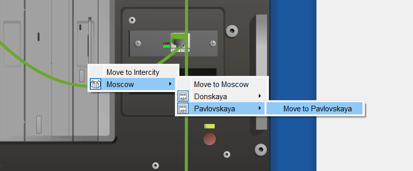
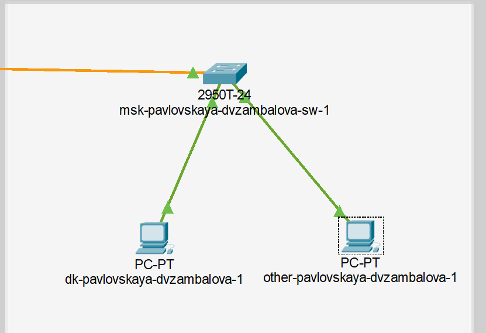
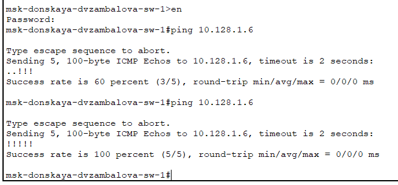
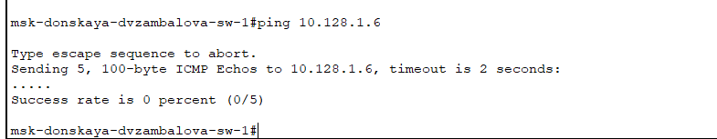
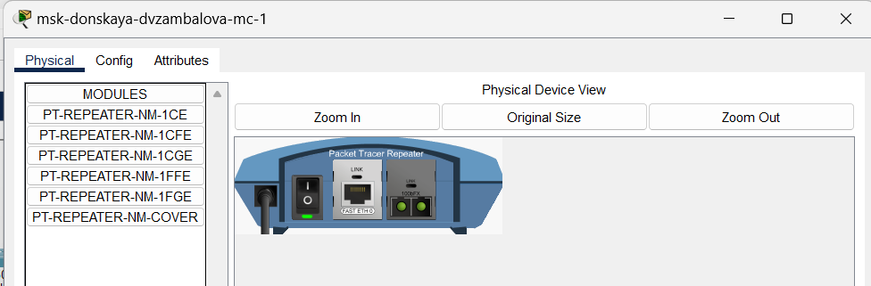
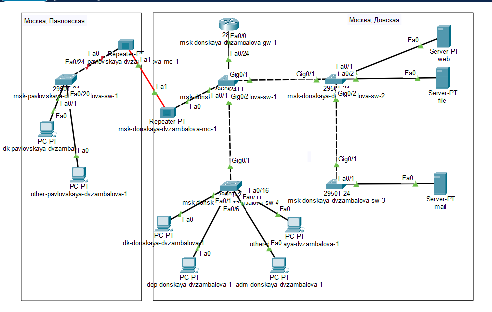

---
## Front matter
lang: ru-RU
title: Лабораторная работа №7
subtitle: Учёт физических параметров сети

author:
  - Замбалова Дина Владимировна
institute:
  - Российский университет дружбы народов, Москва, Россия

## i18n babel
babel-lang: russian
babel-otherlangs: english

## Formatting pdf
toc: false
toc-title: Содержание
slide_level: 2
aspectratio: 169
section-titles: true
theme: metropolis
header-includes:
 - \metroset{progressbar=frametitle,sectionpage=progressbar,numbering=fraction}
 - '\makeatletter'
 - '\beamer@ignorenonframefalse'
 - '\makeatother'
---

# Информация

## Докладчик

:::::::::::::: {.columns align=center}
::: {.column width="70%"}

  * Замбалова Дина Владимировна
  * студентка
  * Российский университет дружбы народов
  * [1132226536@pfur.ru](mailto:1132226536@pfur.ru)
  * <https://github.com/dvzambalova>

:::
::: {.column width="25%"}

:::
::::::::::::::

# Вводная часть

**Цель работы**

Получить навыки работы с физической рабочей областью Packet Tracer,
а также учесть физические параметры сети.

**Задание**

Требуется заменить соединение между коммутаторами двух территорий
msk-donskaya-sw-1 и msk-pavlovskaya-sw-1 на соединение, учитывающее физические параметры сети, а именно — расстояние между двумя
территориями.
При выполнении работы необходимо учитывать соглашение об именовании.

# Выполнение лабораторной работы

{#fig:001 width=70%}

# Выполнение лабораторной работы

{#fig:002 width=70%}

# Выполнение лабораторной работы

{#fig:003 width=45%}

# Выполнение лабораторной работы

{#fig:004 width=35%}

# Выполнение лабораторной работы

{#fig:005 width=70%}

# Выполнение лабораторной работы

{#fig:006 width=70%}

# Выполнение лабораторной работы

{#fig:007 width=70%}

# Выполнение лабораторной работы

{#fig:008 width=70%}

# Выполнение лабораторной работы

{#fig:009 width=70%}

# Выполнение лабораторной работы

{#fig:010 width=70%}

# Выполнение лабораторной работы

{#fig:011 width=70%}

# Выполнение лабораторной работы

{#fig:012 width=70%}

# Выполнение лабораторной работы

{#fig:013 width=70%}

# Выполнение лабораторной работы

:Таблица портов {#tbl:fiz}

| Устройство                       | Порт        | Примечание                         |
|----------------------------------|-------------|------------------------------------|
| msk-donskaya-dvzambalova-sw-1    | f0/24       | msk-donskaya-dvzambalova-gw-1      |
|                                  | g0/1        | msk-donskaya-dvzambalova-sw-2      |
|                                  | g0/2        | msk-donskaya-dvzambalova-sw-4      |
|                                  | f0/1        | msk-donskaya-dvzambalova-mc-1      |
| msk-donskaya-dvzambalova-mc-1    | f0/0       | msk-donskaya-dvzambalova-sw-1       |
|                                  | f0/1       | msk-pavlovskaya-dvzambalova-mc-1    |
| msk-pavlovskaya-dvzambalova-mc-1 | f0/0       | msk-pavlovskaya-dvzambalova-sw-1    |
|                                  | f0/1       | msk-donskaya-dvzambalova-mc-1       |
| msk-pavlovskaya-dvzambalova-sw-1 | f0/24      | msk-pavlovskaya-dvzambalova-mc-1    |
|                                  | f0/1–f0/15 | dk                                  |
|                                  | f0/20      | other                               |

# Выполнение лабораторной работы

{#fig:014 width=70%}

# Выводы

В результате выполнения лабораторной работы я получила навыки работы с физической рабочей областью Packet Tracer,
а также учитывала физические параметры сети.
