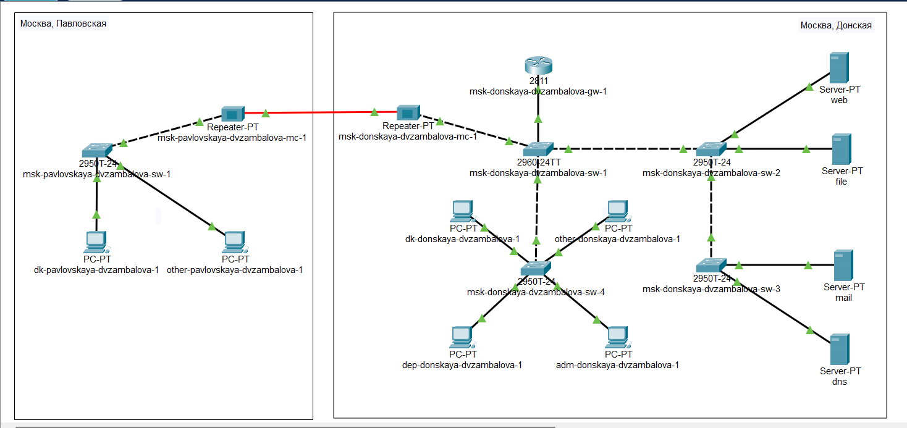
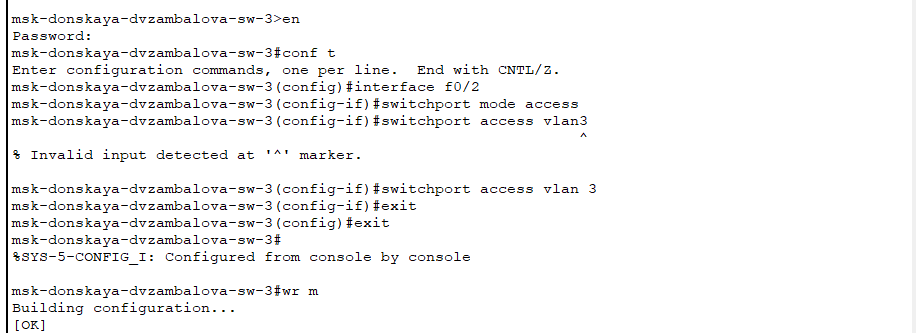
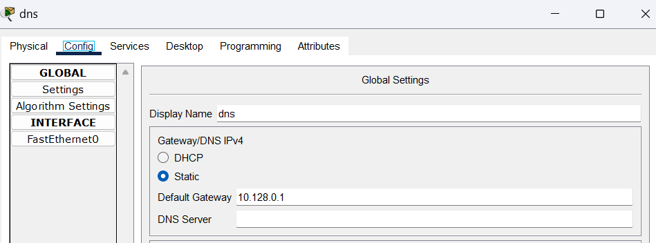
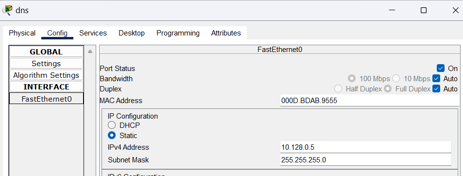
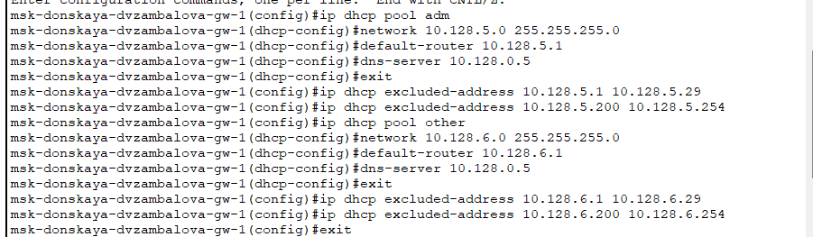
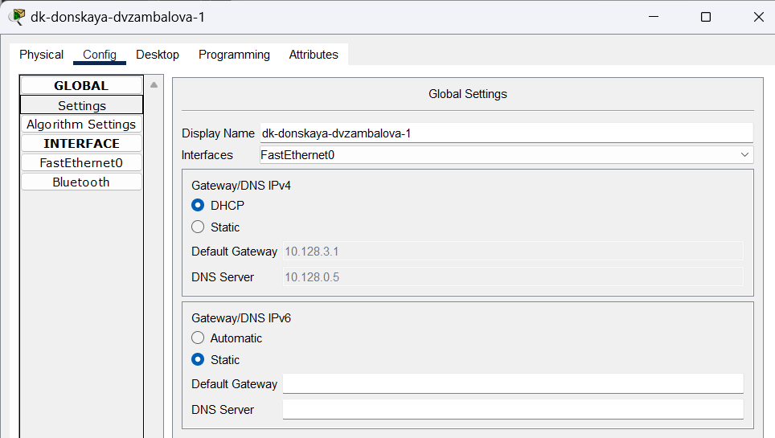
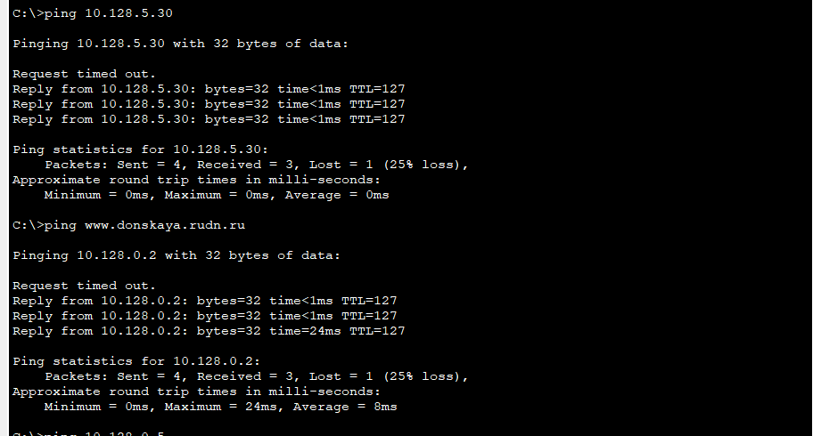
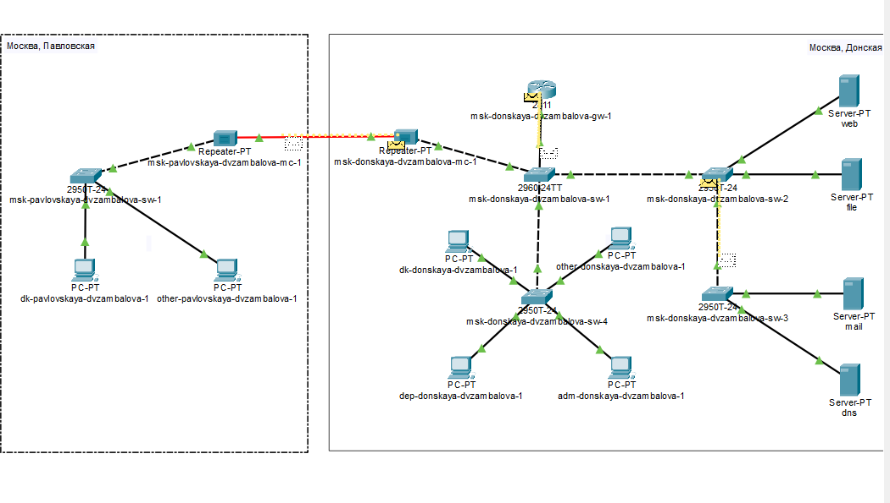
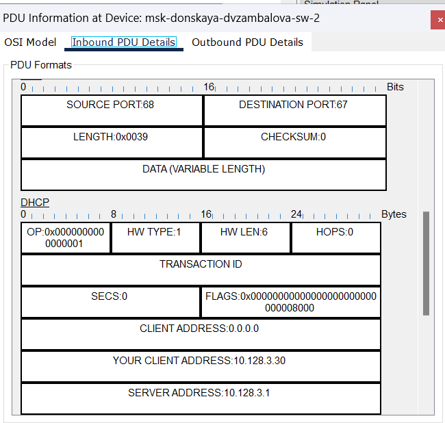

---
## Front matter
lang: ru-RU
title: Лабораторная работа №8
subtitle: Настройка сетевых сервисов. DHCP

author:
  - Замбалова Дина Владимировна
institute:
  - Российский университет дружбы народов, Москва, Россия

## i18n babel
babel-lang: russian
babel-otherlangs: english

## Formatting pdf
toc: false
toc-title: Содержание
slide_level: 2
aspectratio: 169
section-titles: true
theme: metropolis
header-includes:
 - \metroset{progressbar=frametitle,sectionpage=progressbar,numbering=fraction}
 - '\makeatletter'
 - '\beamer@ignorenonframefalse'
 - '\makeatother'
---

# Информация

## Докладчик

:::::::::::::: {.columns align=center}
::: {.column width="70%"}

  * Замбалова Дина Владимировна
  * студентка
  * Российский университет дружбы народов
  * [1132226536@pfur.ru](mailto:1132226536@pfur.ru)
  * <https://github.com/dvzambalova>

:::
::: {.column width="25%"}

:::
::::::::::::::

# Вводная часть

**Цель работы**

Приобрести практические навыки по настройке динамического распределения IP-адресов посредством протокола DHCP (Dynamic Host Configuration Protocol) в локальной сети.

**Задание**

1. Добавить DNS-записи для домена donskaya.rudn.ru на сервер dns.
2. Настроить DHCP-сервис на маршрутизаторе.
3. Заменить в конфигурации оконечных устройствах статическое распределение адресов на динамическое.
4. При выполнении работы необходимо учитывать соглашение об именовании.

# Выполнение лабораторной работы

{#fig:001 width=70%}

# Выполнение лабораторной работы

{#fig:002 width=70%}

# Выполнение лабораторной работы

{#fig:003 width=70%}

# Выполнение лабораторной работы

{#fig:004 width=70%}

# Выполнение лабораторной работы.

{#fig:005 width=70%}

# Выполнение лабораторной работы

:Регламент выделения ip-адресов (для сети класса C) {#tbl:reg}

| IP-адреса | Назначение           |
|-----------|----------------------|
| 1         | Шлюз                 |
| 2–19      | Сетевое оборудование |
| 20–29     | Серверы              |
| 30–199    | Компьютеры, DHCP     |
| 200–219   | Компьютеры, Static   |
| 220–229   | Принтеры             |
| 230–254   | Резерв               |

# Выполнение лабораторной работы

{#fig:006 width=70%}

# Выполнение лабораторной работы

{#fig:007 width=50%}

# Выполнение лабораторной работы

{#fig:008 width=50%}

# Выполнение лабораторной работы

{#fig:009 width=70%}

# Выполнение лабораторной работы

{#fig:010 width=70%}

# Выполнение лабораторной работы

{#fig:011 width=70%}

# Выполнение лабораторной работы

{#fig:012 width=70%}

# Выполнение лабораторной работы

{#fig:013 width=50%}

# Выполнение лабораторной работы

{#fig:014 width=70%}

# Выполнение лабораторной работы

{#fig:015 width=70%}

# Выполнение лабораторной работы

{#fig:016 width=40%}

# Выполнение лабораторной работы

{#fig:017 width=60%}

# Выполнение лабораторной работы

{#fig:018 width=50%}

# Выводы

В процессе выполнения данной лабораторной работы я приобрела практические навыки по настройке динамического распределения IP-адресов посредством протокола DHCP (Dynamic Host Configuration Protocol) в локальной сети.
